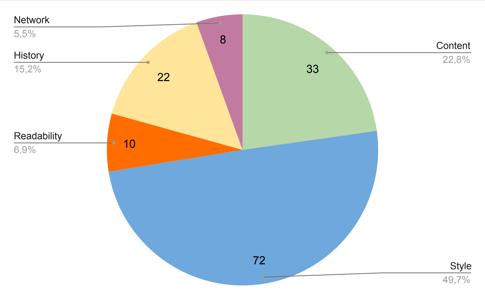

# Features

Our datasets consists of Wikipedia articles and their corresponding features. We have divided the features into five categories: Content, Style, Readability, History, and Network. The features are described in the following sections.

## Content Features

Content features analyze the length and structure of the article. All of them can be directly obtained from the plain text and original wikitext, so they are the fastest to
compute.

| ID     | Description                           | # Papers |
|--------|---------------------------------------|----------|
| CC     | Character Count                       | 61       |
| CW     | Word Count                            | 32       |
| CSN    | Sentence Count                        | 22       |
| CS     | Section Count                         | 32       |
| CMSL   | Mean Section Length                   | 5        |
| CP     | Paragraph Count                       | 12       |
| CMPL   | Mean Paragraph Length (Words)         | 11       |
| CLSL   | Largest Section Length                | 3        |
| CSSL   | Shortest Section Length               | 3        |
| CSTDSL | Standard Deviation of Section Length  | 8        |
| CLSSR  | Longest-Shortest Section Ratio        | 1        |
| CB     | Subsection Count                      | 24       |
| CBPS   | Subsection Count per Section          | 13       |
| CNL    | Introduction Length (Characters)      | 10       |
| CNLTLR | Introduction Length-Text Length ratio | 1        |
| CR     | Reference Count                       | 32       |
| CCC    | Citation Count                        | 17       |
| CCCPC  | Citation Count per Character          | 8        |
| CCCPS  | Citation Count per Section            | 9        |
| CEL    | External Link Count                   | 35       |
| CELPS  | External Link Count per Section       | 6        |
| CELPC  | External Link Count per Character     | 3        |
| CIL    | Internal Link Count                   | 44       |
| CILPC  | Internal Link Count per Character     | 4        |
| CI     | Image Count                           | 42       |
| CIPC   | Images per Character                  | 12       |
| CIPS   | Images per Section                    | 12       |
| CH3    | Number Sub-subsections                | 6        |
| CIB    | Number of Information Boxes           | 14       |
| CCT    | Number of Citation Templates          | 8        |
| CNCT   | Number of Non-Citation Templates      | 7        |
| CUT    | Number of Unique Templates            | 3        |
| CTAB   | Number of Tables                      | 9        |

## Style Features

Style features evaluate how contributors write their sentences, measuring the used word classes and sentence types. They can all be derived from the article’s plain text.

| ID       | Description                                                            | # Papers |
|----------|------------------------------------------------------------------------|----------|
| SSLS     | Largest Sentence Size (in words)                                       | 14       |
| SSSS     | Shortest Sentence Size (in words)                                      | 7        |
| SMSS     | Mean Sentence Size (in words)                                          | 12       |
| SLSR     | Large Sentence Rate (\% sentences that are 10 words greater than SMSS) | 13       |
| SSSR     | Short Sentence Rate (\% sentences that are 5 words shorter than SMSS)  | 14       |
| SQ       | Question Count                                                         | 9        |
| SQPS     | Question Count per Sentence                                            | 4        |
| SE       | Exclamation Count                                                      | 1        |
| SEPS     | Exclamation Count per Sentence                                         | 1        |
| SS       | Syllable Count                                                         | 6        |
| SMSPW    | Mean \# of Syllables per Word                                          | 4        |
| SMCPW    | Mean \# of Characters per Word                                         | 8        |
| SSTP     | \# of sentences starting with a pronoun                                | 8        |
| SSTART   | \# of sentences starting with an article                               | 7        |
| SSTC     | \# of sentences starting with a coordinate conjunction                 | 7        |
| SSTSUB   | \# of sentences starting with a subordinate preposition or conjunction | 7        |
| SSTI     | \# of sentences starting with an interrogative pronoun                 | 6        |
| SSTD     | \# of sentences starting with a determiner                             | 1        |
| SSTADJ   | \# of sentences starting with an adjective                             | 1        |
| SSTN     | \# of sentences starting with a noun                                   | 1        |
| SSTADV   | \# of sentences starting with an adverb                                | 1        |
| SSTPPS   | SSTP per Sentence                                                      | 4        |
| SSTARTPS | SSTART per Sentence                                                    | 4        |
| SSTCPS   | SSTC per Sentence                                                      | 4        |
| SSTSUBPS | SSTSUB per Sentence                                                    | 4        |
| SSTDPS   | SSTD per Sentence                                                      | 1        |
| SSTADJPS | SSTADJ per Sentence                                                    | 1        |
| SSTNPS   | SSTN per Sentence                                                      | 1        |
| SSTADVPS | SSTADV per Sentence                                                    | 1        |
| SMV      | Modal Verb Count                                                       | 9        |
| STB      | ``To be'' Verb Count                                                   | 5        |
| SUW      | Unique Word Count                                                      | 4        |
| SN       | Noun Count                                                             | 2        |
| SUN      | Unique Noun Count                                                      | 2        |
| SV       | Verb Count                                                             | 2        |
| SUV      | Unique Verb Count                                                      | 2        |
| SP       | Pronoun Count                                                          | 7        |
| SUP      | Unique Pronoun Count                                                   | 1        |
| SADJ     | Adjective Count                                                        | 1        |
| SUADJ    | Unique Adjective Count                                                 | 2        |
| SADV     | Adverb Count                                                           | 1        |
| SUADV    | Unique Adverb Count                                                    | 1        |
| SCC      | Coordinating Conjunction Count                                         | 3        |
| SUCC     | Unique Coordinating Conjunction Count                                  | 1        |
| SSUB     | Subordinating Preposition or Conjunction Count                         | 1        |
| SUSUB    | Unique Subordinating Preposition or Conjunction Count                  | 1        |
| STBPV    | ``To be'' Verb Count per Verb                                          | 1        |
| SWL6     | Number of Words Larger than 6 Letters                                  | 4        |
| SMVPW    | SMV per Word                                                           | 4        |
| STBPW    | STB per Word                                                           | 8        |
| SUWPW    | SUW per Word                                                           | 3        |
| SNPW     | SN per Word                                                            | 2        |
| SUNPW    | SUN per Word                                                           | 1        |
| SVPW     | SV per Word                                                            | 2        |
| SUVPW    | SUV per Word                                                           | 1        |
| SPPW     | SP per Word                                                            | 4        |
| SUPPW    | SUP per Word                                                           | 1        |
| SADJPW   | SADJ per Word                                                          | 1        |
| SUADJPW  | SUADJ per Word                                                         | 1        |
| SADVPW   | SADV per Word                                                          | 1        |
| SUADVPW  | SUADV per Word                                                         | 1        |
| SCCPW    | SCC per Word                                                           | 8        |
| SUCCPW   | SUCC per Word                                                          | 1        |
| SSUBPW   | SSUB per Word                                                          | 1        |
| SUSUBPW  | SUSUB per Word                                                         | 1        |
| SUNPUW   | SUN per Unique Word                                                    | 2        |
| SUVPUW   | SUV per Unique Word                                                    | 2        |
| SUPPUW   | SUP per Unique Word                                                    | 1        |
| SUADJPUW | SUADJ per Unique Word                                                  | 1        |
| SUADVPUW | SUADV per Unique Word                                                  | 1        |
| SUCCPUW  | SUCC per Unique Word                                                   | 1        |
| SUSUBPUW | SUSUB per Unique Word                                                  | 1        |

## Readability Features

Readability features assess how easy a text is to read, using carefully designed formulas that combine word, syllable, and character count.

| ID   | Description                 | # Papers |
|------|-----------------------------|----------|
| RARI | Automated Readability Index | 23       |
| RCL  | Coleman-Liau                | 20       |
| RFE  | Flesh reading ease          | 24       |
| RFK  | Flesh-Kincaid               | 27       |
| RGFI | Gunning Fog Index           | 19       |
| RLBI | Lasbarhets Index            | 13       |
| RSG  | Smog-Grading                | 20       |
| RDWS | Difficult Word Score        | 5        |
| RDC  | Dale-Chall                  | 10       |
| RLWF | Linsear Write Formula       | 6        |

## History Features

History features measure an article’s revision history and analyze its authors and contributions.

| ID     | Description                                      | # Papers |
|--------|--------------------------------------------------|----------|
| HA     | Age (days)                                       | 34       |
| HAPR   | Age per Review                                   | 7        |
| HRPD   | Reviews per Day                                  | 12       |
| HRPC   | Reviews per Contributor                          | 13       |
| HRPCSD | Reviews per Contributor Standard Deviation       | 9        |
| HR     | Review Count                                     | 39       |
| HC     | Contributor Count                                | 39       |
| HRC    | Registered Contributor Count                     | 12       |
| HAC    | Anonymous Contributor Count                      | 15       |
| HRCPC  | Registered Contributor Count per Contributor     | 3        |
| HACPC  | Anonymous Contributor Count per Contributor      | 4        |
| HRCPAC | Registered Contributor per Anonymous Contributor | 1        |
| HREV   | Revert Count                                     | 7        |
| HREVPR | Revert Count per Review                          | 4        |
| HRML   | Recent Review (3 months) Diff (Number of lines)  | 7        |
| HREC   | Recent Review (3 months) Count                   | 1        |
| HRECPR | Recent Review (3 months) Count per Review        | 9        |
| HACT   | Active Review Count                              | 3        |
| HACTPR | Active Review Count per Review                   | 7        |
| HOCCPR | Occasional Review Count per Review               | 8        |
| HSSLE  | Seconds since Last Edit                          | 9        |
| HMCL   | Mean Comment Length (characters)                 | 2        |

## Network Features

Network features consider Wikipedia as a graph, where its nodes represent articles and the edges are the citations between them.

| ID         | Description                       | # Papers |
|------------|-----------------------------------|----------|
| NIN        | In-degree                         | 15       |
| NOUT       | Out-degree                        | 14       |
| NASSinin   | Assortativity In-In               | 9        |
| NASSinout  | Assortativity In-Out              | 9        |
| NASSoutin  | Assortativity Out-In              | 9        |
| NASSoutout | Assortativity Out-Out             | 9        |
| NREP       | Reciprocity within Neighbors      | 12       |
| NT         | \# of Versions in other Languages | 14       |

